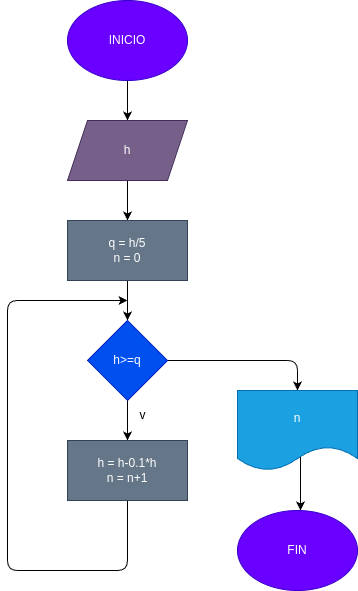

# While_2
Una pelota se deja caer desde una altura h y en cada rebote sube el 10% menos que el anterior, ¿En cual rebote la pelota no alcanza a subir la quinta parte de la altura inicial?

## Anàlisis

### input
h = altura inicial

### processing 
q = h/5
n = 0
mientras h>=q
h = 1h-0.1*h
n = n+1

### diseño

### output
n